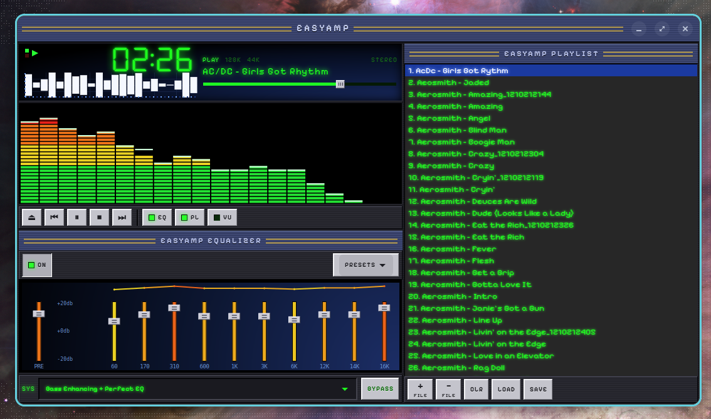
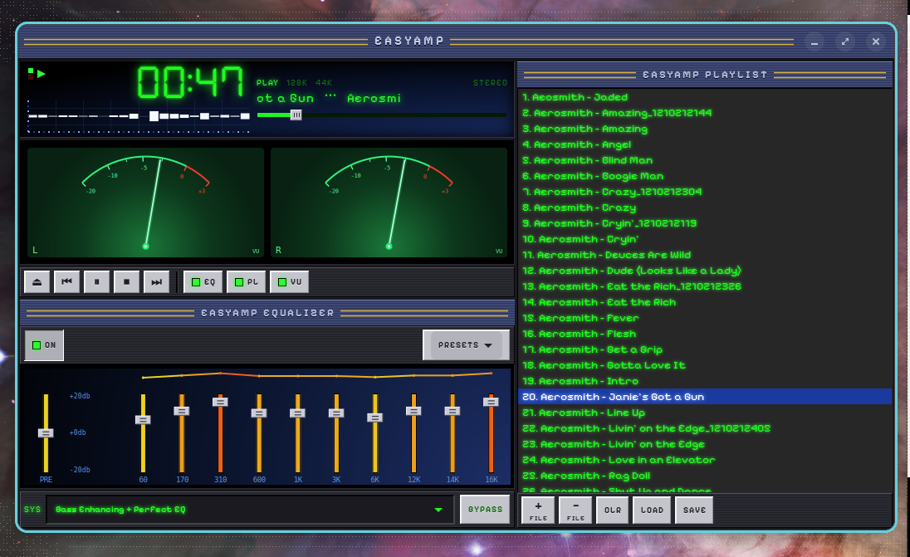

# EasyAmp

A **self-contained classic-player-style media player with a 10-band EQ** — a loving tribute to the late-90s desktop audio player, built fresh in GTK4 with original artwork.

EasyAmp plays your local music through its own GStreamer pipeline (with a built-in graphic EQ) and shows a live spectrum or analog VU meters. Because it owns its own window, the chrome is pixel-styled to evoke the era.

> Original artwork and an original name. EasyAmp uses **no** trademarked names, logos, or skin bitmaps from any media player. It's a tribute to an era, not a clone of a product.





## Features

- **Media player** — open files/playlists (anything GStreamer decodes: MP3, FLAC, WAV, OGG, Opus, M4A…), transport controls, seek, track metadata, `.m3u` load/save.
- **Built-in 10-band graphic EQ** — preamp + 10 bands with a live response curve, value-colored sliders, bypass, and **portable JSON presets** (auto-loads an `EASYAMP DEFAULT` preset if you save one).
- **Visualizer** — switch between a live **green spectrum analyzer** (GStreamer capture + FFT) and dual **analog VU meters** (atomic-green, real dB scale, glowing needle). It captures the system output, so it reflects **all** audio playing on the machine, not just EasyAmp.
- **Mini scope** — a small mirrored bar-graph waveform under the timer.
- **Docked single-window UI** — player + EQ + playlist snap together with EQ/PL toggles, in a beveled gunmetal skin with green LCD readouts.

## Requirements

- Python 3 + PyGObject with **GTK 4** (`gir1.2-gtk-4.0`)
- **GStreamer 1.x** with the base/good plugins (playback, `equalizer-10bands`)
- **numpy** (spectrum FFT)
- A working audio server (**PipeWire** or PulseAudio) for the visualizer capture
- Fonts (OFL) — **DSEG7 Classic** and **Pixelify Sans** ship bundled and auto-install on first run

## Download

Grab a ready-to-run build from the **[latest release](https://github.com/VonHoltenCodes/EasyAmp/releases/latest)**:

| Platform | Download | Notes |
|----------|----------|-------|
| 🪟 **Windows** (x64) | **[Installer (.exe)](https://github.com/VonHoltenCodes/EasyAmp/releases/latest/download/EasyAmp-Setup-x64.exe)** · [Portable (.zip)](https://github.com/VonHoltenCodes/EasyAmp/releases/latest/download/EasyAmp-windows-x64.zip) | Unsigned — at the SmartScreen prompt click **More info → Run anyway** |
| 🍎 **macOS** (Apple Silicon) | **[Disk image (.dmg)](https://github.com/VonHoltenCodes/EasyAmp/releases/latest/download/EasyAmp-macos-arm64.dmg)** | Unsigned — right-click the app → **Open**. Visualizer needs a loopback device (e.g. BlackHole) |
| 🐧 **Linux** | **[Flatpak bundle](https://github.com/VonHoltenCodes/EasyAmp/releases/latest/download/EasyAmp.flatpak)** | `flatpak install --user EasyAmp.flatpak` |

> Everything is bundled — no Python or GTK install required. To build from source instead, see below.

## Install (from source)

See **[INSTALL.md](INSTALL.md)** for full per-OS instructions. In short: install
the native prerequisites (GTK4 + PyGObject + GStreamer) from your OS package
manager / Homebrew, then:

```bash
pipx install . --system-site-packages    # gives you an `easyamp` launcher
```

Bundled fonts (DSEG7, Pixelify Sans — both SIL OFL) are copied into your user
font directory on first run, so the intended look shows up with no manual setup.

## Run (without installing)

```bash
./run.sh
# or
python3 -m easyamp
```

## Architecture

See [`ARCHITECTURE.md`](ARCHITECTURE.md) for the design. In short: a GStreamer `playbin` (with `equalizer-10bands` as its `audio-filter`) handles playback; the spectrum/VU come from an independent GStreamer `pulsesrc` capture of the system output, so they reflect *all* audio playing on the machine.

## Authors

- **Created and authored by [VonHoltenCodes](https://github.com/VonHoltenCodes)** (Trenton Von Holten) — main author & creator.
- **Co-authored with Claude** (Anthropic's Claude Code).

## Credits & acknowledgements

EasyAmp stands on a lot of open-source work — thank you to:

- **[GStreamer](https://gstreamer.freedesktop.org/)** — playback pipeline, the `equalizer-10bands` graphic EQ, and the capture source.
- **[PipeWire](https://pipewire.org/)** — audio capture for the visualizer.
- **[GTK 4](https://www.gtk.org/) / [PyGObject](https://pygobject.gnome.org/)** — the UI toolkit.
- **[DSEG](https://github.com/keshikan/DSEG)** 7-segment font by keshikan (SIL OFL).
- **[Pixelify Sans](https://fonts.google.com/specimen/Pixelify+Sans)** by Stefie Justprince (SIL OFL).

If you maintain something EasyAmp uses and want different/expanded credit, please open an issue.

## License

[MIT](LICENSE). EasyAmp is completely open source. Bundled fonts are under the SIL Open Font License (see [THIRD-PARTY-LICENSES.md](THIRD-PARTY-LICENSES.md)).
