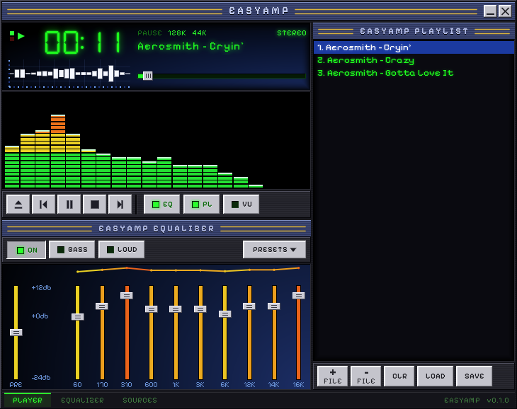
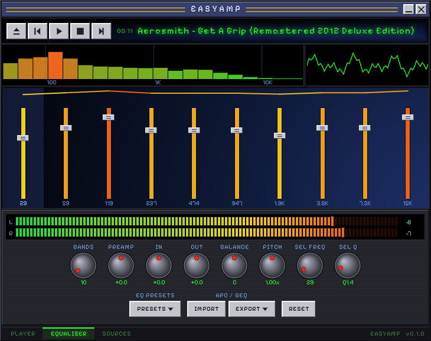
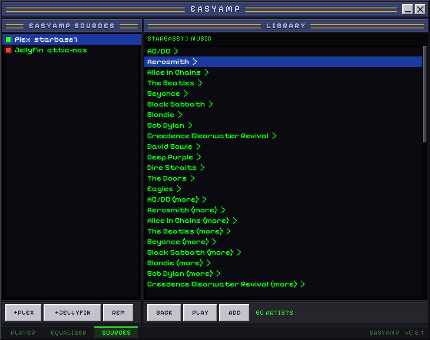
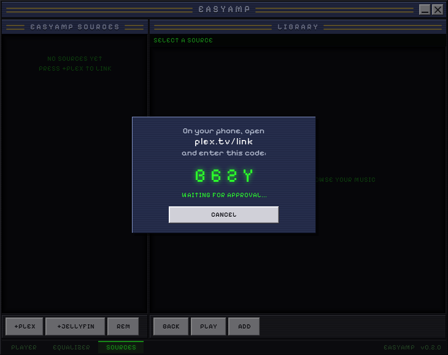
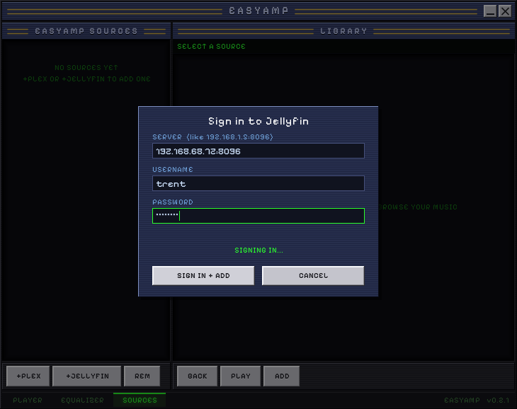
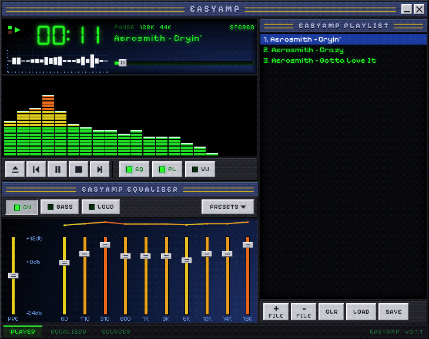
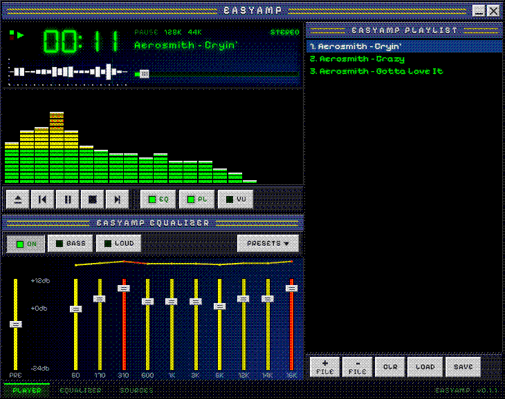
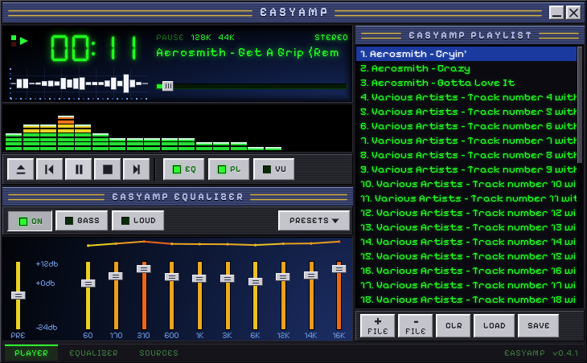

# EasyAmp retro — Windows 98 SE / XP

A native build of EasyAmp for machines the GTK app can never reach: one ANSI
Win32 executable that runs on Windows 98 SE through XP SP3, on a Pentium II
class CPU (no SSE), in 16 MB of RAM.

It is a sibling of the GTK app, not a port: same look, same EQ model and
preset roster, same playlist format, written from scratch in C.




## How it is built

| Piece | File | Notes |
|---|---|---|
| Renderer | `src/gfx.c` | Every pixel is drawn in software into a 32-bit buffer and handed to Windows as one picture. No GDI text, pens or theming, so 98 SE, XP and Wine render identically. |
| Fonts | `tools/mkfont.py` → `src/fonts_gen.c` | DSEG7 and Pixelify Sans pre-rasterized with their LCD glow baked in, so nothing is blurred at runtime. |
| Interface | `src/ui.c` | Layout, chrome, widgets, input. Portable C; static chrome is painted once per page and widgets repaint only their own patch. |
| Model | `src/app.c` | Transport, playlist, EQ bands and presets. |
| Signal path | `src/dsp.c` | In-gain → N parametric bands → BASS/LOUD shelves → balance → out-gain → soft limit; FFT analysis for the meters. x87 float, denormal-safe. |
| Playback | `src/engine_win32.c` | Worker thread: minimp3 / PCM WAV → varispeed → DSP → `waveOut`. Meters are analysed at the position the card is actually playing. |
| Shell | `src/main_win32.c` | Borderless window, file dialogs, drag and drop, ID3 titles, m3u. |

## Plex and Jellyfin




Linking is phone-first: the app shows a four-character code and the user
enters it at plex.tv/link on another device, because these PCs cannot open
plex.tv themselves. plex.tv requires TLS 1.2, which neither Windows 98 nor
XP can speak, so those few calls go through BearSSL (fetched at build time,
pinned; `make anchors` regenerates the trust anchors). Everything after
that - browsing and streaming - is plain HTTP to the server on the LAN, so
it costs the old CPU nothing. The server must allow that: Settings >
Network > Secure connections = Preferred, not Required.

MP3 tracks stream straight off the server with seeking. Anything else (AAC,
FLAC, ...) is requested through the server's transcoder as MP3; those
streams cannot seek. If Windows cannot resolve a name the client asks
1.1.1.1 / 8.8.8.8 itself, because retro boxes often carry a DNS setting that
died years ago. Names are folded from UTF-8 to the ASCII the fonts carry.

Jellyfin is a typed sign-in (server address, user, password) against
`/Users/AuthenticateByName`; tracks use `/Audio/<id>/universal` with MP3 as
the only container the client claims, so the server sends MP3 as-is and
transcodes the rest. The password is never stored and is wiped from memory
after sign-in.



Account tokens are saved in `EASYAMP.INI` beside the exe **in plain
text**: Windows 98 has no protected store. Unlink with REM, or revoke the
device in Plex > Settings > Authorized Devices.

`tests/tlstest.c` (`make build/TLSTEST.EXE`) checks one machine: TLS 1.2 to
plex.tv, which DNS path was used, whether the OS random generator answered.

## Colour depth

Windows 98 boxes run anything from 16 colours to true colour, and left alone
GDI ruins a subtle skin on all but the last: it truncates to 16-bit (erasing
the 2-6% scanline sheen and banding the gradients), and on a 256-colour
desktop it maps everything onto a default palette with almost no dark blues.
So the client converts its own picture, per desktop depth, re-checked on
`WM_DISPLAYCHANGE`:

| Desktop | Path |
|---|---|
| 24 / 32-bit | as drawn |
| 15 / 16-bit | ordered dither to 5-5-5 / 5-6-5 |
| 256 colours | its own 236-colour palette, tuned to the skin from the app's renders (`make palette`), realized while in front, plus dither |
| 16 colours | dither into the fixed VGA 16 |

The dither matrix is keyed to screen position, so partial redraws tile
without seams and nothing shimmers. `/depth:32|16|15|8|4` forces a path on
any desktop.




## Build

```sh
make fonts   # regenerate the glyph atlases (needs Pillow, numpy, scipy; commit the result)
make palette # re-tune the 256-colour palette after a visual change (commit the result)
make shots   # render every UI state to build/shots/*.png, no Windows needed
make test    # filters + analyzer, JSON, EQ file formats, list multi-select
make win        # cross-compile build/EASYAMP.EXE (needs i686-w64-mingw32-gcc)
make installer  # build/EasyAmp-Retro-Setup.exe (needs nsis)
```

The subsystem / OS version stamps in the Makefile are what let a real
Windows 98 loader accept the file. `-mno-sse` and `MINIMP3_NO_SIMD` keep it
runnable on a Pentium II or Mendocino Celeron.

`EASYAMP.EXE file.mp3 /shot:out.bmp /shotms:4000` plays a file, saves what is
on screen after four seconds, and exits — how the running program is checked
under Wine.

## Status

Verified on real hardware: an HP Pavilion 6460 (Windows 98 SE, Celeron 400,
256-colour desktop) and a Windows XP SP3 box.

- Player, Equalizer and Sources pages; transport, seek, keyboard.
- Local MP3, FLAC, Ogg Vorbis and PCM WAV. Drag and drop, m3u load / save.
- 10-32 band parametric EQ with presets, shelves, BASS / LOUD, balance,
  varispeed pitch. IMPORT / EXPORT read and write the GTK app's formats:
  Equalizer APO config files and the AutoEQ `GraphicEQ:` line.
- Spectrum / VU / scope / LED meters.
- Plex and Jellyfin, up to four accounts at once (see below). Ctrl / Shift
  click, Shift + arrows and Ctrl + A select several rows; ADD, PLAY and ADD ALL
  take tracks as they are and expand folders to every track beneath them,
  with a live count and BACK to stop. The playlist selects the same way.
- The EQ and PL buttons hide their panels and the page reflows.
- Settings, the EQ bank, the window position and the playlist are kept
  between runs in `EASYAMP.INI` / `EASYAMP.M3U` beside the exe.

Not yet: a 2x window for large monitors, album art, gapless playback.

## Small screens

The design is 730 x 578. A screen with less usable height than that (an
800x600 laptop, a 1024x600 netbook, once the taskbar is subtracted) gets a
shorter layout: `ui_set_height()` lets the visualizer, the slider banks and
the lists give up the space, down to `EA_MIN_H` (452), and everything else
keeps its size and stays pixel-crisp. Only when the screen is still too small
(640x480 is too narrow) does the shell scale the finished picture down with an
area-averaging filter (`gfx_downscale`), before colour reduction. The window
is measured against the work area (`SPI_GETWORKAREA`), re-fitted on
`WM_DISPLAYCHANGE`, and a remembered position is clamped onto the screen.
`/fit:WxH` pretends the usable desktop is that size.



## Installer and portable

`installer/easyamp.nsi` builds `EasyAmp-Retro-Setup.exe` with NSIS: its
installers still run on Windows 95 and later, and `makensis` is a native Linux
program, so CI builds it with no Windows machine involved. `Unicode false`
(ANSI) is what lets the result load on Windows 9x. It installs to Program
Files, adds Start Menu and desktop shortcuts and an Add/Remove Programs entry;
the uninstaller asks before removing settings, because they hold server
sign-ins, and defaults to keeping them.

The same `EASYAMP.EXE` is also the portable build. Settings live beside the
exe when that folder can be written, otherwise in `%APPDATA%\EasyAmp` (a
limited account on XP cannot write to Program Files).

`web/` is the plain-HTTP download page served at
`http://dl.easyampstereo.com/retro/`: HTML 3.2, no scripts, no TLS, because
the machines this is for cannot open an HTTPS site to fetch it.

## Things that will bite you

- **An import Windows 98 lacks is fatal, not degraded**: the loader refuses
  to start the program. `make win` runs `tools/check-imports.sh` and deletes
  the exe if it finds one. It has caught two so far: `_strtoi64` (one
  `sscanf` call pulls in mingw's scanf) and `_ftelli64` (dr_flac's stdio
  layer - it is fed through callbacks instead).
- The fonts are ASCII. Metadata is folded from UTF-8 (`json.c`).
- The icon must be classic BMP-format entries (`tools/mkicon.py`). Pillow's
  own .ico writer stores PNG, which Windows only reads from Vista on: on 98
  and XP the taskbar button and every shortcut showed the generic icon.
- Anything a human must TYPE elsewhere cannot use the skin's pixel font:
  Pixelify draws 2/Z, 5/S, 8/B and 0/O identically.

## Third party

`third_party/minimp3.h` — lieff/minimp3, CC0. `third_party/jsmn.h` — zserge/jsmn, MIT.
`third_party/dr_flac.h` — mackron/dr_libs, public domain / MIT-0. `third_party/stb_vorbis.c` — nothings/stb, public domain / MIT.
BearSSL — Thomas Pornin, MIT, fetched by `tools/fetch-bearssl.sh`.
Fonts: DSEG7 Classic and Pixelify Sans, SIL OFL (see `easyamp/fonts/`). The Plex link code alone
is drawn in DejaVu Sans Mono Bold (Bitstream Vera licence): Pixelify draws 2/Z, 5/S, 8/B and 0/O
as the same shape, and that string is typed by hand into a phone.
